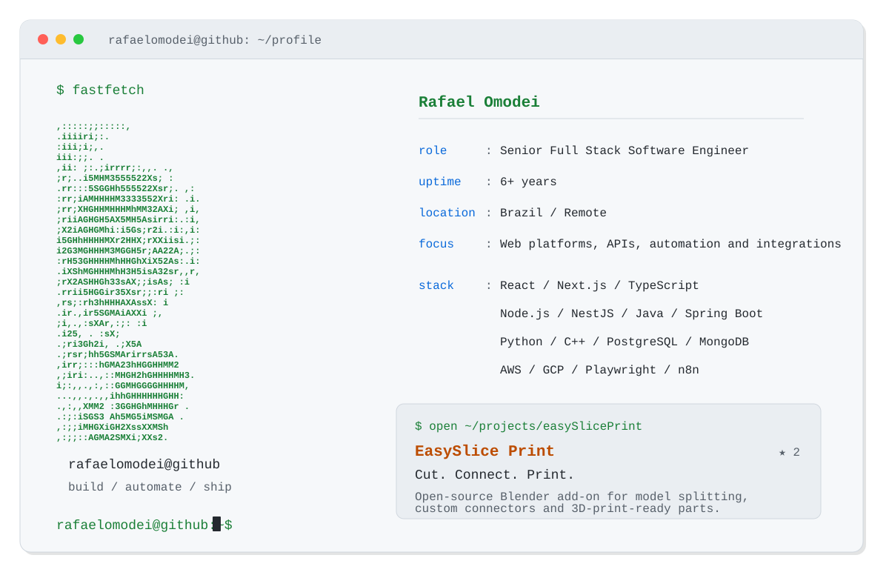

<a href="https://github.com/rafaelomodei">
  <picture>
    <source media="(prefers-color-scheme: dark)" srcset="./assets/terminal-dark.svg">
    
  </picture>
</a>

  <a href="https://github.com/rafaelomodei/easySlicePrint"><strong>EasySlice Print</strong></a>
  &nbsp;·&nbsp;
  <a href="https://rafaelomodei.github.io/easySlicePrint/">Project website</a>
  &nbsp;·&nbsp;
  <a href="https://www.linkedin.com/in/rafael-geovani-omodei-52919a1a1">LinkedIn</a>

  Terminal profile generated with TypeScript + GitHub Actions.

